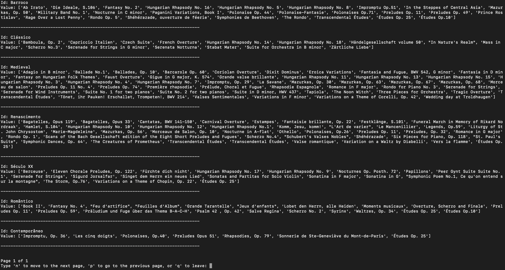

# Análise de um dataset de obras musicais 
# Somador (ON/OFF)

## Autor
- Nome : Tiago André Leça Carneiro
- Número : A93207


## Resumo
### Requisitos

Neste TPC foi pedido que fosse analizado um ficherio CSV e que, sem utilizar o módulo CSV do python fosse possível apresentar:

1. Lista ordenada alfabeticamente dos compositores musicais;
2. Distribuição das obras por período: quantas obras catalogadas em cada período;
3. Dicionário em que a cada período está a associada uma lista alfabética dos títulos das obras
desse período.

### Solução

Para a resolução deste TPC foi necessário pensar numa expressão regular capaz de capturar todas as entradas presentes no [CSV](obras.csv). Após pensar um pouco sobre o problema, cheguei a seguinte expressão:

---
**EXPRESSION**

<!---
^<span id="name" style="color:cornflowerblue">([^;]+);</span><span id="description" style="color:lightpink">("(?:[^"]|"")* "|[^;]* );</span><span id="creationyear" style="color:violet">(\d{4});</span><span id="period" style="color:green">([^;]+);</span><span id="composer" style="color:firebrick">([^;]+);</span><span id="duration" style="color:orange">(\d{2}:\d{2}:\d{2});</span><span id="id" style="color:coral">(O\d+)</span>$
-->

```
^([^;]+);("(?:[^"]|"")*"|[^;]*);(\d{4});([^;]+);([^;]+);(\d{2}:\d{2}:\d{2});(O\d+)$
```

---

Primeiramente, para conseguirmos compreender esta expressão, temos que considerar que os dados seguem a seguinte estrura :
```
nome;desc;anoCriacao;periodo;compositor;duracao;_id
```
Assim, entre cada grupo obrigamos a que o caracter ';' apareça.

Com isto em mente, podemos agora falar de cada grupo em específico:

- <span id="name" style="color:cornflowerblue">Nome - </span> ```([^;]+);``` Começamos por dar match no primeiro grupo a todos os caracteres expecto pelo ';', já que sabemos que esse vai apenas aparecer no fim.
- <span id="description" style="color:lightpink">Descrição - </span> ```("(?:[^"]|"")* "|[^;]* );``` Aqui procuramos por texto que esteja entre áspas (" "), tendo em conta que este campo pode estar vazio, e ignorando áspas extras que possam ser encontradas pelo meio da descrição. Algo igualmente importante é o facto de não guardarmos o grupo interno que ignora as áspas internas, para que cada grupo guardado expresse a estrutura anteriormente mencionada
- <span id="creationyear" style="color:violet">Ano de Criação - </span>```(\d{4});``` Para o ano de criação, procuramos por 4 digitos seguidos de ';' .
- <span id="period" style="color:green">Periodo - </span>```([^;]+);``` Procuramos todos os elementos excepto ';', mas acabando com esse caracter.
- <span id="composer" style="color:firebrick">Compositor - </span>```([^;]+);``` Exatamente o mesmo processo que para o campo anterior.
- <span id="duration" style="color:orange">Duração - </span> ```(\d{2}:\d{2}:\d{2});``` Para a duração, procuramos pela estrutura comum para representar um espaço de tempo, 2 digitos para as horas, seguidos por ':', 2 digitos para os minutos, seguidos por ':', e por fim 2 digitos para os segundos.
- <span id="id" style="color:coral">ID - </span>```(O\d+)``` para o id, procuramos por digitos tantas vezes quantas existirim, mas também procuramos pela letra O (o maíusculo), pois em alguns dos casos encontrados no [CSV](obras.csv), este caracter foi utilizado em vez do dígito 0.

Após serem encontradas as respetivas correspondências para a expressão regular mencionada acima, são criadas as seguintes extruturas :

- <span style="color:teal">Composers - </span>Um set onde ficaram guardados os nomes dos compositores presentes no [CSV](obras.csv), sendo este set ordenado alfabéticamente após a leitura na totalidade do mesmo.
- <span style="color:gold">Period_Count - </span> Um dicionário onde a chave é o período da obra, e o valor é a sua frequência.
- <span style="color:yellowgreen">Period_Works - </span> Um dicionário onde a chave é o período da obra, e o valor é uma lista dos nomes das obras com esse periodo, ordenada alfabéticamente.

Para além do ficheiro com a solução ([tpc2.py](tpc2.py)) adicionei o ficheiro [pagination.py](pagination.py), com funções para poder representar sets e dicionários de uma forma paginada, para melhor clareza e leitura.

### Output
#### Menu


#### 1.


#### 2.


#### 3.

## Lista de Resultados

- [tpc2.py](tpc2.py)
- [pagination.py](pagination.py)
