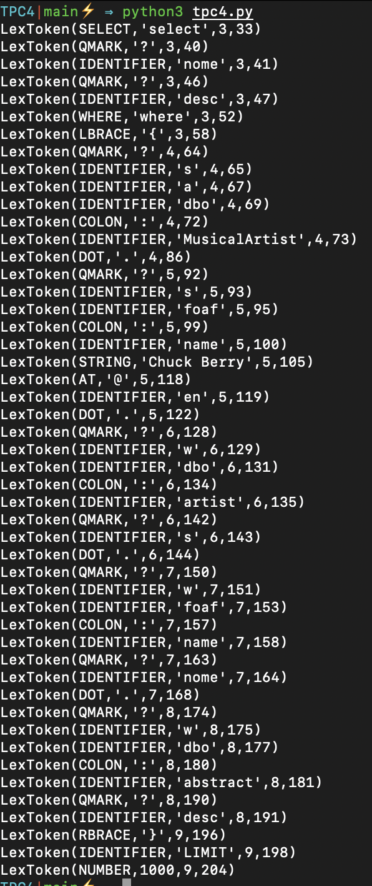

# Analizador léxico

## Autor
- Nome : Tiago André Leça Carneiro
- Número : A93207


## Resumo

Construir um analisador léxico para uma liguagem de query.

### Requisitos

Ser capaz de analizar o seguinte tipo de mensagens :

```
# DBPedia: obras de Chuck Berry

select ?nome ?desc where {
    ?s a dbo:MusicalArtist.
    ?s foaf:name "Chuck Berry"@en .
    ?w dbo:artist ?s.
    ?w foaf:name ?nome.
    ?w dbo:abstract ?desc
} LIMIT 1000
```
### Solução 

Para ser capaz de solucionar este problema, foi necessária a criação de um *Tokenizer*, tendo eu tomado a decisão de utilizar a biblioteca *ply.lex*

Para tal, começamos por definir a lista de palavras reservadas : 

```py
reserved = {
    'select': 'SELECT',
    'where': 'WHERE',
    'limit': 'LIMIT',
    'a': 'A'
}
```

De seguida, definimos o resto dos *Tokens* que podemoremos encontrar :

```py
tokens = [
    'IDENTIFIER',
    'NUMBER',
    'STRING',
    'DOT',
    'COLON',
    'EQUALS',
    'QMARK',
    'LBRACE',
    'RBRACE',
    'AT'
] + list(reserved.values())
```

Estando agora definidos todos os *Tokens*, é necessário definir as regras que serão utilizadas para os identificar.

Os *Tokens* mais simples foram identificados da seguinte forma :

```py
t_DOT = r'\.'
t_COLON = r'\:'
t_EQUALS = r'='
t_QMARK = r'\?'
t_LBRACE = r'\{'
t_RBRACE = r'\}'
t_AT = r'@'
```

Para os *Tokens* mais complexos, seguiu-se a seguinte extrutura para definir funções capazes de os detetar : 

```py
def t_NUMBER(t):
    r'\d+'
    t.value = int(t.value)
    return t
```

Assim, basta iniciar o lexer e dar-lhe o input desejado :
```py
lexer = lex.lex()

data = open('input/test.file').read()

lexer.input(data)
```


### Output

Ao analizar o exemplo, os seguintes tokens são identificados : 



## Lista de Resultados

- [tpc4.py](tpc4.py)
