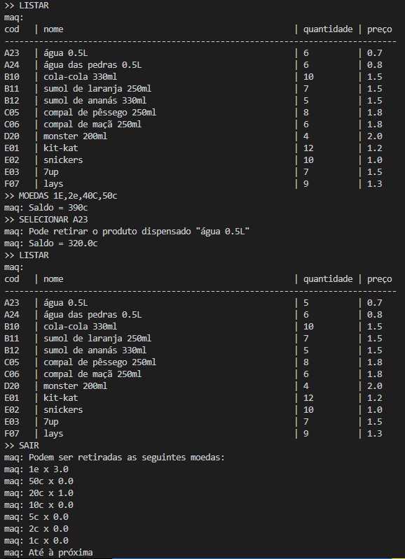

# Máquina de Vending

## Autor
- Nome : Tiago André Leça Carneiro
- Número : A93207


## Resumo

Construir uma máquina de vendas seguindo o guião dado pelos professores.

### Requisitos

Foi pedido que a máquina de vendas fosse capaz de fazer o seguinte :
- Listar os items disponíveis
- Ser capaz de adicionar moedas
- Selecionar items e decrementar do total
- Sair da máquina, dando o troco em moedas e atualizando o ficheiro de stock

### Solução

Para este problema, optei por não utilizar um *Tokenizer*. Comecei por ler o stock, estando este em formato json, e colocar a informação retirada num dicionário, sendo o código da máquina de cada produto as respetivas chaves de cada elemento deste dicionário. 

Estando o dicíonário povoado, inicio a função *menu* , cujo objetivo visa ser de identificar o comando que o utilizador deseja realizar. Para tal, recorro a biblioteca *re* e utilizando expressões regulares, chamo a função pertinente para o comando pedido. 

De notar que nesta função menu as expressões regulares são compiladas de inicio, de maneira a tornar o programa mais eficiente.

O único outro ponto notável desta solução seria a maneira de identificar as moedas que o utilizador deseja inserir. Para tal, recorro novamente a expressões regulares, mas para identificar todas as ocorrencias de números seguidos de *e* ou *E* para os euros e *c* ou *C* para os cêntimos. Encontrando então todas estas ocurrências, é conferido um dicionário de moedas para identificar o valor da moeda inserida.

Para maior clareza podemos observar de seguida a função.

#### Função para inserir moedas

```py
def insert_coin(command):
    global cash
    coins = {"1e": 100, "50c": 50, "20c": 20, "10c": 10, "5c": 5, "2c": 2, "1c": 1}
    euros = re.compile(r"\d+[eE]")
    cents = re.compile(r"\d+[cC]")
    for eu in euros.findall(command):
        cash += int(eu[:-1])
    for cent in cents.findall(command):
        cash += int(cent[:-1])
```

### Output



Como podemos observar pela imagem anterior, todos os requisitos foram atingidos.

## Lista de Resultados

- [tpc5.py](tpc5.py)
- [stock.json](dataset/stock.json)
