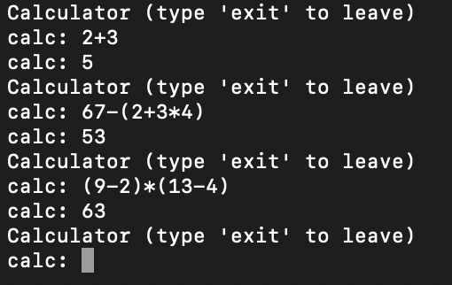

# Recursivo Descendente para expressões aritméticas

## Autor
- Nome : Tiago André Leça Carneiro
- Número : A93207


## Resumo

Criar um parser LL(1) recursivo descendente que reconheça expressões aritméticas e calcule o respetivo valor.

### Requisitos

Para sermos capazes de criar o parser, é necessário começar por criar um tokenizer capaz criar os seguintes tipos de tokens : 

```py
tokens = [
    'NUMBER',
    'PLUS',
    'MINUS',
    'TIMES',
    'DIVIDE',
    'LPAREN',
    'RPAREN'
]
```
Após os tokens estarem definidos, foram definidas as precedências :

```py
precedence = (
    ('left', 'PLUS', 'MINUS'),
    ('left', 'TIMES', 'DIVIDE'),
    ('right', 'UMINUS')
)
```

Por fim, foram criadas as expressões para o parser, como por exemplo :

```py
def p_expression_divide(p):
    'expression : expression DIVIDE expression'
    if p[3] == 0:
        raise ZeroDivisionError("division by zero")
    p[0] = p[1] / p[3]
```

### Output

Testando com os inputs dados : 



## Lista de Resultados

- [tpc6.py](tpc6.py)
